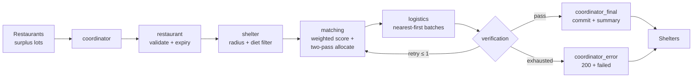

# FOODLINK AI — Real-Time Multi-Agent Food Rescue

Six AI agents move surplus restaurant food to nearby shelters in real time:
**Detect → Match → Negotiate → Hand Off → Deliver → Verify.**

- **Live demo (share link, demo inventory):** https://food-link-app-ten.vercel.app/
- **Presentations run on localhost** (`:5173` + `:8000`) against the real backend — never the share link.
- **Runnable notebook:** [`FOODLINK_Demo.ipynb`](FOODLINK_Demo.ipynb) (same demo as [`FOODLINK_Demo.py`](FOODLINK_Demo.py))

## Chosen vertical & problem

Restaurants waste surplus meals while nearby shelters run unmet demand, because no
real-time coordination layer exists: no live surplus registry, no
distance/dietary/expiry-aware matching, and no auditable handoff trail.
Manual rescue is slow, expiry-ignorant, and cannot handle concurrent claims on
the same lot. FOODLINK AI is that layer.

## Approach & algorithmic logic



- **Agent pipeline** (`backend/app/foodbridge/workflow.py`, `agents.py`):
  `coordinator → restaurant → shelter → matching → logistics → verification → coordinator`.
- **Matching** (`backend/app/foodbridge/scoring.py`): haversine distance, demand
  (`capacity − occupancy`), urgency, capacity, dietary compatibility, and expiry
  scores combined with normalized weights
  (distance .50 / demand .10 / urgency .15 / capacity .05 / compatibility .10 / expiry .10,
  auto-normalized to sum 1.0), then greedy **two-pass allocation**
  (full-demand fits first, partial leftovers second).
- **Safety rails:** synchronous reserve/release guard (one in-flight match per lot;
  losers get 409 `SURPLUS_ALREADY_ALLOCATED`/`SURPLUS_IN_PROGRESS`), verification
  node with bounded retry (`MATCH_MAX_RETRIES=1`), match timeout
  (`MATCH_TIMEOUT_SECONDS=10`), expired-lot rejection before matching.
- **Honesty contract:** allocations, distances, ETAs, confidence, and summaries
  render only from API responses; simulated inventory is labeled demo
  (`frontend/src/data/api-client.ts`, `live-mapper.ts`, `lib/impact.ts`).

## How it works end-to-end

1. Restaurants register surplus lots (`POST /api/foodbridge/surplus`); the board
   (`frontend/src/features/surplus/SurplusBoard.tsx`) shows live expiry countdowns.
2. "Rescue" runs the six-agent workflow (`POST /api/foodbridge/match`); logistics
   batches stops nearest-first (ETA = km/25×60); verification commits
   (`allocated` on full, decrement on partial).
3. Replay, 3D district, Leaflet map, operations ledger, and impact stats all read
   the same workflow events. Full matches consume the lot (board drains honestly);
   `POST /api/foodbridge/demo/reset` restores seed data (12 restaurants, 9 lots,
   3 shelters).
4. Measured latency: match `duration_ms` ≈ **12–15 ms warm** (in-process
   LangGraph), ~1–2 s cold including first workflow compile.

## Problem-term → code map

| Declared concept | Where it lives |
|---|---|
| match surplus ↔ shelters | `POST /api/foodbridge/match`, `score_all` in `scoring.py` |
| nearby | radius filter in `shelter_node` (`agents.py`), haversine in `scoring.py` |
| real time | `asyncio.wait_for` timeout in `run_match_workflow`, live board countdowns |
| multi-agent / specialized agents | six nodes + routers in `agents.py`, graph in `workflow.py` |
| negotiate | matching ↔ verification bounded retry (`MATCH_MAX_RETRIES=1`) |
| hand off tasks | logistics batches → `coordinator_final_node` commit |
| autonomously | no human input between coordinator intake and verified commit |
| surplus / lots | `FoodSurplus` in `models.py`, registry in `store.py` |
| urgency / demand / dietary | `Shelter` model, `shelter_demand`, compatibility score |
| verification | `verification_node`, `MatchResponse.error` codes |

## Assumptions & operational constraints

- **SDG 9 — Industry, Innovation & Infrastructure (Target 9.4).** Every match
  response carries machine-readable proof of resource-efficient automation:
  `total_allocated`/`unallocated` meal counts, per-stop distances and ETAs in
  `metadata.logistics.batches`, and `duration_ms` (12–15 ms warm) showing resilient
  computational heuristics with minimal computing overhead. Diverting perishable
  surplus to nearby shelters upgrades local food infrastructure instead of
  landfilling it.

- Provider-agnostic LLM, `mock` by default (`LLM_PROVIDER=mock`); set a real
  provider key for live summaries, otherwise deterministic `[DEMO MODE]` text.
- Vercel share-link builds leave `VITE_API_URL` **unset** (demo mode);
  localhost sets `VITE_API_URL=http://localhost:8000` for the live backend.
- Single-branch (`main`), public repo; secrets never committed (`.env` gitignored).
- E2E needs backend on `:8000` + frontend on `:5173` (`workers: 1` — specs share one seed lot).

## Run & test

```bash
# backend (from backend/)
python -m venv venv && venv\Scripts\activate
pip install -r requirements.txt
uvicorn app.main:app --port 8000
pytest tests/            # 47 tests

# frontend (from frontend/)
npm install
npm run dev              # http://localhost:5173 (VITE_API_URL=http://localhost:8000 in .env)
npm test                 # 34 unit tests
npm run test:e2e         # Playwright, needs backend up
```

See `frontend/README.md` (product guide) and `frontend/KNOWN_ISSUES.md` (accepted tradeoffs).
