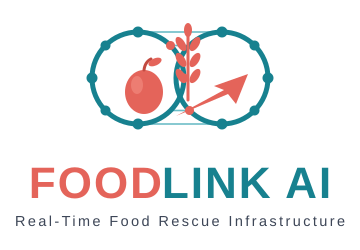

# FOODLINK AI — Real-Time Multi-Agent Food Rescue Interface



Cinematic operations frontend for the FOODBRIDGE backend: six AI agents
coordinate surplus food from restaurants to shelters, rendered as a live
3D district plus a fully equivalent text interface.

Detect → Match → Negotiate → Hand Off → Deliver → Verify.

## Quick start (live demo)

Terminal 1 — backend (from `hackathon-starter/backend`):

```bash
python -m venv venv && venv\Scripts\activate
pip install -r requirements.txt
uvicorn app.main:app --port 8000
```

Terminal 2 — frontend (this folder):

```bash
npm install
npm run dev        # http://localhost:5173, VITE_API_URL=http://localhost:8000 in .env
```

Present from **localhost only** (`:5173` + `:8000`). A shareable link build
(with `VITE_API_URL` unset) runs in labeled demo mode — never present that.

## Test commands

| Command | What it runs |
|---|---|
| `npm test` | Unit suite only — 34 tests across 8 files (`src/**`, correctly excludes `e2e/`) |
| `npm run test:e2e` | Playwright + Chromium against the **real** backend (no mocks), `workers: 1`, ~15s |
| `npm run lint` | oxlint — zero errors expected (see KNOWN_ISSUES.md for accepted warnings) |
| `npm run build` | `tsc -b` + production bundle |
| backend `pytest tests` | 45 tests, run from `hackathon-starter/backend/` |

E2E prerequisites: backend up on `:8000` (each spec resets seed data itself).
`npm test` never touches the network.

## Demo reset flow

Rescues consume surplus lots, so the board drains with use. Before presenting:

1. Control panel → **Reset demo data** (or `POST /api/foodbridge/demo/reset`),
   which restores seed lots and reloads the catalog.
2. **Refresh the browser tab** — the catalog loads on boot/run/reset, not on
   a polling loop (a >60s-away tab auto-refreshes on refocus; see below).

The board shows a low-stock badge at ≤2 available lots.

## Data honesty rules (do not regress)

- Allocations, distances, ETAs, confidence, timestamps come from API
  responses only — never invented. Missing ETAs render as "—".
- Impact math lives in `src/lib/impact.ts` (single source of truth);
  CO₂ figures are estimates with printed methodology.
- Backend `summary` strings render verbatim, never reworded.
- Anything simulated is labeled demo data.

## Accessibility contract

Full keyboard access, visible focus, `prefers-reduced-motion` disables all
ambient animation, and a complete no-WebGL DOM fallback carries every piece
of information the 3D scene shows.

See **KNOWN_ISSUES.md** for accepted tradeoffs and deferred items.
